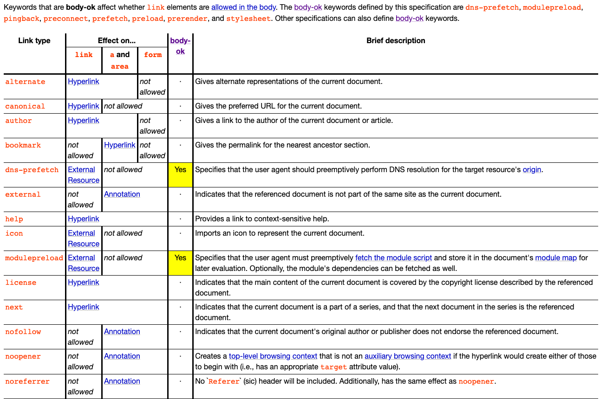
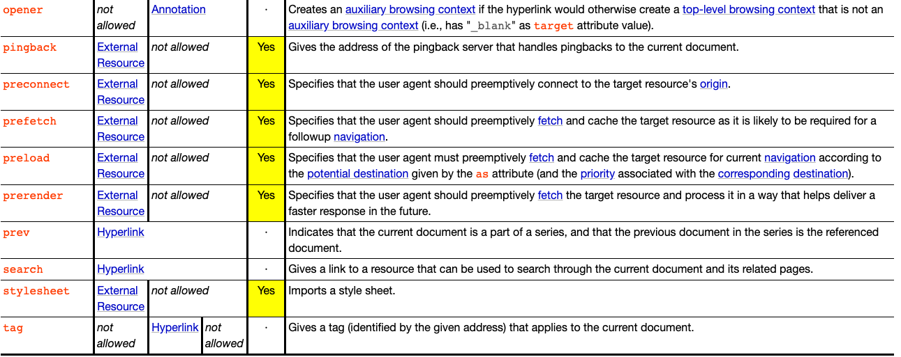

# Link标签

>HTML外部资源链接元素：规定了当前元素与外部资源之间的关系。该元素最常用于链接样式表，此外也可以被用来创建站点图标（比如PC端的favicon图标和移动端设备上用以显示在主屏幕的图标）

## Link 标签使用

1. <link href="style.css" rel="stylesheet">

使用<link />标签加载样式表， <link />标签可以出现在<head>或者<body>元素中，具体取决于他是否有一个body-ok的链接类型

上图可以看到，stylesheet的链接类型是body-ok，也就是说这类型的<link />标签是可以放在body中。
但是从最佳实践上，我们是一般都是把stylesheet放在<head />标签里的

在浏览器渲染时，会构建一个DOM树，和一个CSSOM树，然后合并为一颗渲染树，最后渲染在页面上。
但是DOM和CSSOM是分开渲染的。也就是说：DOM树渲染完成，渲染树就会开始构建了，再构建完成后，页面就已经展示有元素了。
那么，问题就会出现了，如果在body中放入stylesheet，那么可能就会出现DOM树和渲染树已经构建完成，而CSS样式表还在加载，于是页面就会出现一次，首次渲染出来没有CSSOM的DOM结构，然后在CSS样式加载完成后，构建CSSOM树，重新生成渲染树。最后再次渲染再页面上。简单的表现就是：页面可能会有跳一下的效果。

所以stylesheet放在head中，先加载css，在CSS加载完成后再构建DOM树，最后CSSOM和DOM树合并为渲染树。
相比于放在body中：少了一次构建渲染树，以及计算布局，和一次渲染页面。

2. <link rel="shortcut icon" href="/favicon.ico" /> 加载页面需要的icon, shortcut是为了兼容IE

3. <link rel="dns-prefetch" href="//test.xixi" /> DNS预解析

chrome 会自动把当前页面的所有带href的link的dns都prefetch一遍
需要手动添加link标签的场景是：你预计用户在后面的访问中需要用到当前页面的所有链接都不包含的域名

正确的使用姿势
1.对静态资源域名做手动dns prefetching。
2.对js里会发起的跳转、请求做手动dns prefetching。
3.不用对超链接做手动dns prefetching，因为chrome会自动做dns prefetching。
4.对重定向跳转的新域名做手动dns prefetching，比如：页面上有个A域名的链接，但访问A会重定向到B域名的链接，这么在当前页对B域名做手动dns prefetching是有意义的。